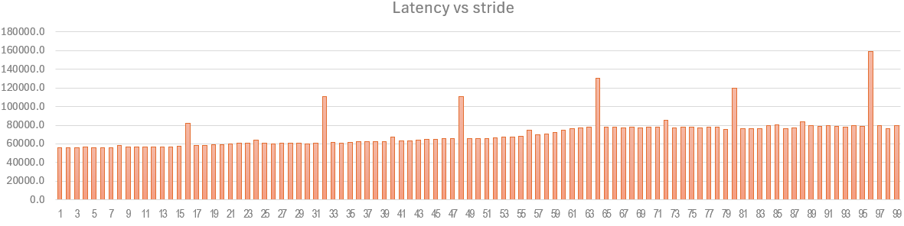

# Basic fact: Cache-Penalties of accessing B matrix column-wise
B matrix is stored in row-major order, register-blocking matmul kernel accesses B matrix in column wise or strided pattern (a fixed distance exists between two cache-line hits), we change the stride of B from 1-cacheline to 100-cacheline, and measure the latency of a 6x2 avx2-register blocking kernel as following:

## 1. huge loss of effective cache capacity at some special strides
RaptorLake P-core L2 cache is in 2048(KB) 16-way, so:

- each cache-set contains 16-way-cachelines which is 16x64 = 1(KB);
- there are 2048(KB)/1(KB) = 2048 L2-cache-sets in total;
- the affress bits in `tag-setindex-offset` format and `setindex` part encodes the index of cache-set being mapped.

and our test has memory-footprint of 220(KB) in total, which means at least 220 L2-cache-sets should be mapped to avoid L2-miss.

- when stride is 8-cachelines, 2048/8=256 cache-sets will hit, which is enough to hold the 220(KB) footprint.
- when stride is 16-cachelines, 2048/16=128 cache-sets will hit, 220KB memory-footprint causes big L2-cache miss-rate.
- when stride is 17-cachlines (note 2048%17=8):
    - in round1, 0'th cache-line in each 17-cachelines group will hit
    - in round2, 9'th cache-line in each 17-cachelines group will hit
    - in round3, 10'th cache-line in each 17-cachelines group will hit
    - ... finanly all cache-line in 17-cachelines group will hit.

- when stride is 24-cachlines (note 2048%24=8):
    - in round1, 0'th cache-line in each 24-cachelines group will hit
    - in round2, 16'th cache-line in each 24-cachelines group will hit
    - in round3, 8'th cache-line in each 24-cachelines group will hit
    - in round4, 0'th cache-line in each 24-cachelines group will hit
    - ... only (0,16,8) cache-lines in 24-cachelines group will hit, which provides (2048*3/24)=256(KB) effective capacity which is just enough to hold 220(KB)

## 2. gradual increasement of cache-miss
 we also observe slow increase of latency along with regular strides, for regular strides, whole memory footprint can be contained in L2, why it still increases?
 
 this is due to L1-cache miss, L1 prefetcher works best in streaming case, in strided case it's worser at large strides, SW prefetch can help this a lot.

 - https://en.wikipedia.org/wiki/Row-_and_column-major_order
 - https://stackoverflow.com/questions/57344826/how-does-cache-associativity-impact-performance
 - https://en.wikipedia.org/wiki/Cache_placement_policies#Set-associative_cache
 - https://www.techpowerup.com/298104/latency-increase-from-larger-l2-cache-on-intel-raptor-cove-p-core-well-contained-report

## Solution

 1. repack B matrix at runtime or offline when there is oppotunities to reuse it multiple times, repacked layout should align the memory=location with the actual access pattern, so streaming access w/o stride happens at runtime instead of strided access.

 2. if there is no chance to reuse B matrix, we can change the access pattern to row-wise to more align with:
    - HW-prefetcher's haviour, so HW-prefetcher can hide mem-access latency for us;
    - cache-set associative mapping logic so full cache-capacity can be effectively used;
    - use SW-prefetcher instructions

# Basic fact: Cache-Penalties of register blocking kernel

With limited general register file size, register blocking kernel can determine a fixed BM & BN dimension of sub-A & sub-B matrix,
but the reduction dimension K is not limited by GRF size, if K is so big that sub-A & sub-B oveflow L1 or L2 cache, this
would hurt performance since loading into L1 & L2 from DDR would definitely hurt performance(mem-bound).

So we can sure that K dimension must be blocked too. BK should at least be small enough to ensure **sub-A & sub-B fits L1 or L2 cache**.
(if L2 bandwith can feed register blocking kernel well, we can allow them to be in L2).

with this basic blocking unit: `subC[BM, BN] += subA[BM, BK] x subB[BK, BN]`, the next question would be how to maximize cache hit rate.

In CPU kernel, ALU is working on accumulation into different subC sequentially, if we choose to let sub-B resident in cache and reuse it
as much as we can, the best strategy would be letting cache blocking to work on `subC[M, BN] += subA[M, BK] x subB[BK, BN]` row by row.
this way, we got (here we assume M, BN, BK are all in unit of register blocking size):

 1. M x BN x K x 2 (FLOPS) computations;
 2. subA & subB are read from DDR once;
 3. subC is read-from/write-to DDR (K/BK) times

to minize total DDR access per computation (or maximize computations/per-DDR-access):

$$
\frac{K \cdot BN + M \cdot K + M \cdot BN \cdot \frac{K}{BK}}{M \cdot BN \cdot K} = \frac{1}{M} + \frac{1}{BN} + \frac{1}{BK}
$$

given $BK \cdot BN \approx L2CacheSize$, letting $BN == BK$ and minimize above metric.

Another idea is making M dimension as the last level of blocking, but this actually would require accessing subB multiple times which is not good.

